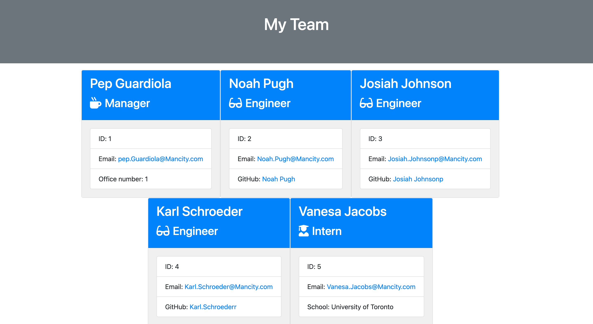

# Team-Profile-Generator

## Licensing:

## Table of Contents

- [Description](#description)
- [Installation](#installation)
- [Usage](#usage)
- [Contribution](#contribution)
- [Testing](#testing)
- [Additional Info](#additional-info)

## Description:

The Inquirer module from Node.js was used to develop this application, which generates a team profile based on user input and displays the data on a freshly created html page with a style sheet.

## Installation:

use inquirer from your command line to answer questions abour the project you are workking on.

## Usage:

use inquirer from your command line to answer questions abour the project you are workking on.

## Walkthrough video

https://drive.google.com/file/d/1IYqgntJqyYp7WzRUV34FR1ycASmKi74S/view

## License:

MIT

## Contribution:

Contributors should read the installation section.

## Testing:

Run `npm test` to run Jest for tests on constructors.

## Additional Info:

- Github: [Favour01216](https://github.com/Favour01216)
- Email: Favouradesiyan2@gmail.com
